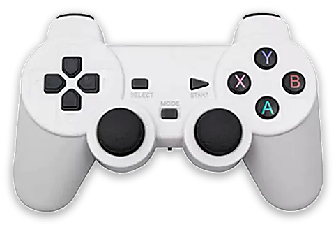
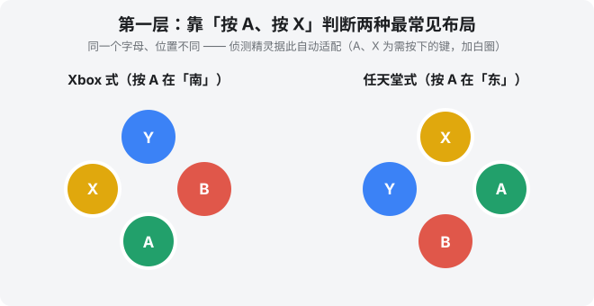
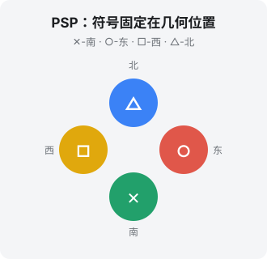

# 手柄按键说明（ES4All / EmuELEC）

## 先跑一次键位精灵

第一次进入 ES 时，按下手柄上任意一颗键，**键位精灵**就会跳出来，跟着提示走一遍即可。之后全机的键位都以这一次的设定为准：

> **键位精灵 → `es_input.cfg` → ES 界面 / RA / 独立模拟器**

精灵随时可以重跑，重跑就完整覆盖。

### 本文用的测试手柄

下图这支是编写与验证本文时用的**测试手柄**：

它的特征很典型——**外形是 PS 手柄，按键印刷却是 Xbox 式**（**A 在南、B 在东、X 在西、Y 在北**），而且**只有 SELECT / START / MODE，没有 Guide（中央）键**。市面上不少手柄都是这个样子，拿它当例子有代表性。

> 本文一律用**南（下）/ 东（右）/ 西（左）/ 北（上）**描述按键位置——因为「A 在哪」会随手柄印刷而变，但**方位不会变**。

### 跑精灵时的两点建议

| 项目 | 建议 | 原因 |
|---|---|---|
| **热键** | 选 **SELECT** | 只是约定俗成，改别的键也完全可以，各模拟器会跟着走 |
| **热键别选 L2 / R2** | ⚠️ **扳机无效** | L2/R2 是**模拟轴**不是按键，而组合键只吃数位按键，拿轴当修饰键做不出来 |

> 精灵走到热键那一步时，画面上会直接提示这件事。

---

手柄按键在本固件里分**三层**处理，各层的判断依据不同——搞清楚这三层，就不会再被「A/B/X/Y 到底谁是谁」绕晕。

| 层 | 场景 | 判断依据 | 一句话 |
|---|---|---|---|
| <nobr>第一层</nobr> | **ES4All 界面**（A=确认、B=返回…） | **按键印刷** | 按你手柄印的字母走 |
| <nobr>第二层</nobr> | **RA / 独立模拟器 热键 / 菜单**（退出、存档、呼出菜单…） | **按键印刷**（同第一层） | 约定俗成，按印的字母认； RA 与独立模拟器**都已随 ES 透传**，但两者机制不同 |
| <nobr>第三层</nobr> | **游戏内操作** | **按键位置** | 按几何位置对齐，跟熟悉感走 |

> **为什么第二层按印刷、第三层按位置，两层还能共存？**
> 在 **RA** 上它们是分开的两套设定，互不干扰。但**独立模拟器（PPSSPPSDL / flycast）
> 的菜单与游戏内共用同一份映射**，无法分开——所以那边的取舍是：
> **面键（A/B/X/Y）屈就第三层按位置**，**组合键仍按印刷**。
> 面键决定游戏手感，必须让位；组合键没有这个包袱。

---

## 第一层：ES4All 界面 —— 基于「按键印刷」

界面上会显示「A 确认 / B 返回」这类提示，所以这一层**跟着你手柄印的字母**走才不会别扭。

市面手柄的 A/B/X/Y 印刷主要有**两种布局**，本固件用一个极简的侦测精灵搞定：**按提示按一下 A** 即可自动判断你是哪种，并配好界面的确认/返回。

- **按 A 在「南」（下）** → Xbox 式
- **按 A 在「东」（右）** → 任天堂式

> 侦测结果只写入 `InvertButtons`（决定前端 A=确认 / B=返回跟着印刷走）。**第一层是唯一需要「知道你是哪种手柄」的地方**，因为它牵涉「字母印在哪」。第二、三层都不看这个。

---

## 第二层：RA / 独立模拟器 热键 —— 基于「按键印刷」

跟第一层一样**按印的字母认**（按印着 X 的那颗）即可。这些组合键早已广为人知：

| 组合键 | 功能 | RA | 独立模拟器 |
|---|---|---|---|
| **热键 + START** | 退出游戏 | ✅ | ✅ |
| **热键 + R1**（右肩键） | 保存即时存档 | ✅ | ✅ |
| **热键 + L1**（左肩键） | 读取即时存档 | ✅ | ✅ |
| **热键 + X**（印着 X 那颗） | 呼出菜单 | ✅ | ✅ |
| **热键 + Y** | 切换 FPS 帧率显示 | ✅ | ❌ 模拟器本身没有这个功能 |

说明：

- **热键就是你在精灵里指定的那颗**，不写死 SELECT。四组组合键的修饰键会一起跟着变。
- **组合键的第二颗按「印刷的字母」认**（`热键 + 印着 X 的那颗` = 菜单），跟第一层同源，不是几何位置。单支手柄下完全正常；只有在 Xbox↔任天堂 两种手柄间换用时，同一组合键的物理位置才会不同。
- **SELECT / START 也从精灵透传**。这一点在只有「−」「＋」两颗的手柄上很重要：哪颗算 SELECT、哪颗算 START **没有客观答案**，只有你在精灵里的指定算数。

### ⚠️ RA 与独立模拟器：结果一致，机制完全不同

两边现在**都已接上透传**，但底下走的是两条路，排查问题时别混为一谈：

| | RA | 独立模拟器（PPSSPPSDL / flycast） |
|---|---|---|
| 组合键怎么写 | RetroArch 自己的 autoconfig | 我们的 joy 脚本按 `es_input.cfg` 生成 |
| 键的表示法 | **实体按键编号** | flycast：**实体按键编号** PPSSPP：**SDL 语义码**（如 `10-196`=SELECT） |
| 要不要「翻译」 | 不用 | flycast 不用；**PPSSPP 要** |
| 菜单与游戏内 | **可以分开**（两套设定） | **不能分开**（共用同一份映射） |

这张表解释了两类常见现象：

- **同一支手柄，RA 正常但独立模拟器不正常**——多半出在「翻译」那一步。PPSSPP 用的是 SDL 语义码，得先把精灵给的实体编号转成语义名（`back` / `start` / `x`…）再转成码；不用翻译的地方就没有译错的机会。
- **独立模拟器的面键「不听话」**——那是刻意的。菜单与游戏内共用一份映射，面键只能屈就[第三层](#第三层游戏内操作--基于按键位置写死原厂布局不需适配)按位置排，详见该节。

> **实作位置**：RA 侧在 `setsettings.sh`；独立模拟器侧在 `set_flycast_joy.sh` / `ppsspp.sh`，
> 两支都读 `es_input.cfg`。**比对 `es_input.cfg` 时一律按 GUID（抹掉 CRC 段）**，
> 不要按名字——同一支手柄在 UDEV、SDL、gamecontrollerdb 里可能是**三个不同的名字**，
> 按名字查会静默落空。

---

## 第三层：游戏内操作 —— 基于「按键位置」（写死原厂布局，不需适配）

进游戏后**绝对按位置（熟悉感）**走：找出各主机原厂手柄的按键几何布局，把物理位置对齐过去。这样「按下方键 = 触发下方那颗」，跟真机手感一致。

以 **PSP** 为例，符号固定在几何位置：**✕-南、○-东、□-西、△-北**。

> **⭐ 关键设计：第三层不需要「知道」你是 Xbox 还是任天堂手柄。**
> 位置对齐的本质是「物理南键 → 游戏底部按钮」，而**物理位置在两种手柄上是一样的**（南边那颗，不管印 A 还是 B，都在南边；手柄回报的 `BTN_SOUTH` 等 evdev 码本来就是按位置定义的）。所以这一层**直接写死原厂布局**，对任何手柄都自动位置对齐——**不需要侦测、不需要开关**（曾经的「游戏内互换 A/B、X/Y」两个开关已废除，它们只会造成困惑）。

> **⚠️ 一个前提：这个「手柄无关」只在「位置锚定」的输入驱动下才成立。** 手柄怎么给面键编号，取决于输入驱动：
>
> | 驱动 | 谁在用 | 编号依据 | 印刷相关? |
> |---|---|---|---|
> | **udev** | EmuELEC 的 RetroArch | evdev 语义码（`BTN_SOUTH` 等，按位置定义） | **否**，一套规则通吃 |
> | **sdl2 GameController** | 独立 PPSSPP / flycast | SDL 语义键（a=南 b=东 x=西 y=北） | **理论上否，实际上不一定**，见下 |
> | **linuxraw / 原始索引** | 旧设置 / 部分老机 | HID 报告顺序 | **是**，任天堂/Xbox 各一套 |
>
> 策略：**RA 走 udev、独立模拟器走 SDL GameController**。一旦落到 linuxraw 的原始索引，就得按布局分开、每支手柄实测。**同一支手柄换了输入驱动、键位就会变**（如 linuxraw → udev/sdl2），正是这个原因。

> **⚠️ 大坑：不能直接拿 SDL 的 `a/b/x/y` 当位置用。**
> SDL 的 `a/b/x/y` **按定义是位置**（a=南 b=东 x=西 y=北），但这要 **gamecontrollerdb 的条目真的按位置写**才成立。
> 山寨手柄的条目常常是**按字母写的**——实测某支手柄 db 写 `a:b1`，而实体 1 其实在**东**：
> 它指的是「印着 A 的那颗」，不是南边那颗。照单全收就会让 ✕○ / □△ 整组位置颠倒。
>
> **真实位置只有 ES 知道**，因为它有 db 没有的两样东西：①印刷字母 → 实体编号（键位精灵）
> ②印刷布局（`InvertButtons`）。两者一组合就能反推：
>
> | `InvertButtons` | 南 | 东 | 西 | 北 |
> |---|---|---|---|---|
> | `false`（Xbox 式） | a | b | x | y |
> | `true`（任天堂式） | b | a | y | x |
>
> 独立模拟器的面键就是这样定位的：四颗全部拿得到才动手，少一颗则整组退回 db 语义——
> 宁可维持原样，也不要产出半套（半套比全错更难查）。
>
> ⚠️ 排查时留意：**两个错误可能互相抵消**。「db 按字母写」配上「代码里又翻转一次」，
> 在山寨手柄上刚好转回来，看起来 A/B 是对的、只有 X/Y 不对。
> **一半对一半错，往往就是双重错误的征兆**，别只修露馅那一半。

这一层对**全部 15 个常用平台**自动按各自原厂布局映射，无需手动逐一设置。下面按「面键形态」分类，方便对照测试（**上/下/左/右 = 物理位置**）：

### ① 四键钻石（最适合测 A/B、X/Y 对调）

| 平台 | 上 | 下 | 左 | 右 | 备注 |
|---|---|---|---|---|---|
| **SNES / SFC** | X | B | Y | A | +L/R |
| **PlayStation / PSX** | △ | ✕ | □ | ○ | +L1/L2/R1/R2 |
| **PSP** | △ | ✕ | □ | ○ | 同 PSX |
| **Dreamcast** | Y | A | X | B | +L/R 扳机（模拟量） |

### ② 两键横排（只能测 A/B，测不了 X/Y）

| 平台 | 左 | 右 | 备注 |
|---|---|---|---|
| **NES / FC** | B | A | 仅 2 键 |
| **Game Boy / GBC** | B | A | 仅 2 键 |
| **GBA** | B | A | +L/R 肩键 |
| **PC Engine** | II | I | 仅 2 键（I 为主键） |
| **Apple II** | 键0 | 键1 | 仅 2 键、常只用 1 颗，**几乎测不出对调** |

### ③ 三 / 六键横排

| 平台 | 布局 | 备注 |
|---|---|---|
| **Genesis / MD** | 3 键：A B C（横排）；6 键版：上排 X Y Z ／ 下排 A B C | |
| **Saturn** | 6 键：上排 X Y Z ／ 下排 A B C | +L/R |

### ④ 特殊布局

| 平台 | 布局 | 备注 |
|---|---|---|
| **N64** | A（大）、B + C 键组（C↑↓←→）+ Z 扳机 + L/R | 非标准钻石 |
| **MAME / FBNeo（街机）** | 因游戏而异：格斗多为 6 键（弱/中/重 · 拳/脚）；Neo Geo 为 A B C D 四键 | 四键以上最易看出对调 |
| **PC（DOS 等）** | 以键盘 / 鼠标为主，手柄映射到通用键 | |

> **测试建议**：验证 A/B、X/Y 对调，优先用 **① 四键钻石**（SNES / PSX / PSP / DC）或 **街机格斗**（四键分明，一眼看出）；**② 两键**只能验 A/B；**Apple II 几乎看不出来**，别拿它测。

> **实现上**：libretro 核心的位置对齐走 **per-core remap**——`setsettings.sh` 在启动时写 `remappings/<核心>/<核心>.rmp`（`input_player1_btn_a="0"` / `btn_b="8"`，把 udev autoconfig 的「标签对齐」扳成位置对齐；udev 下 X/Y 本就对齐，故只翻 A/B）。⚠️**remap 文件夹名必须 = 核心运行时的 `library_name`，不是 `.info` 里的 `corename`**：个别核心两者不一致（如 `applewin` 小写 vs 运行时 `AppleWin` 大写），会导致 remap 写错文件夹、RA 加载不到、该平台退回标签对齐＝乱——靠 `setsettings.sh` 里一张极小的例外修正表补掉（目前仅 `applewin→AppleWin`，其余核心 corename 一致）。
>
> **独立模拟器（PPSSPPSDL / flycast）**不吃 remap，由各自的 joy 脚本直接生成映射：面键按上面「从 ES 反推真实位置」的办法排（PSP ✕南○东□西△北；DC 与 Xbox 同布局，上 Y 下 A 左 X 右 B），组合键则按印刷。
>
> **PSP 用哪个模拟器按机型而定**：弱机（如 S905W2）跑不动独立版，默认走 libretro ppsspp 核心，吃上面这套 remap；GPU 够力的机型（如 RK3566 的 Mali-G52）默认走独立 PPSSPPSDL。
